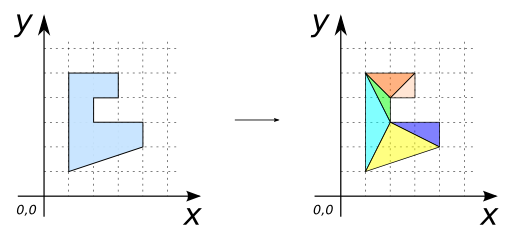
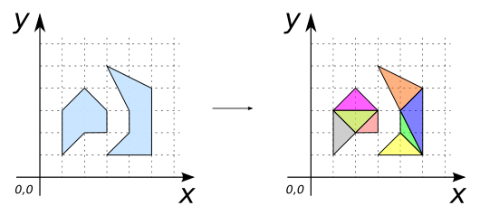
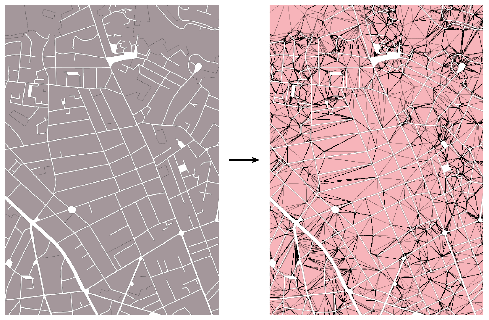

### Signature


GEOMETRY ST_Tessellate(GEOMETRY geom)


### Description
Return the tessellation of a `geometry` with adaptive triangles.

### Remark
Input geometry (`geom`) can only be a `POLYGON` or a `MULTIPOLYGON`. 

### Examples

##### Case with `POLYGON`


SELECT ST_Tessellate('POLYGON ((1 1, 1 5, 3 5, 3 4, 2 4, 
				2 3, 4 3, 4 2, 1 1))');

-- Answer: 
MULTIPOLYGON (((1 5, 2 4, 3 5, 1 5)), ((2 4, 3 4, 3 5, 2 4)), 
	      ((2 4, 1 5, 2 3, 2 4)), ((1 5, 1 1, 2 3, 1 5)), 
	      ((2 3, 1 1, 4 2, 2 3)), ((2 3, 4 2, 4 3, 2 3)))


##### Case with `MULTIPOLYGON`


SELECT ST_Tessellate('MULTIPOLYGON (
			((1 1, 1 3, 2 4, 3 3, 3 2, 2 2, 1 1)), 
  			((3 5, 4 3, 4 2, 3 1, 5 1, 5 4, 3 5)))');

-- Answer: 
MULTIPOLYGON (((2 4, 1 3, 3 3, 2 4)), ((1 3, 2 2, 3 3, 1 3)), 
	      ((2 2, 3 2, 3 3, 2 2)), ((1 3, 1 1, 2 2, 1 3)), 
	      ((3 5, 4 3, 5 4, 3 5)), ((4 3, 5 1, 5 4, 4 3)), 
	      ((4 3, 4 2, 5 1, 4 3)), ((4 2, 3 1, 5 1, 4 2)))


##### Application with real data

The tessellation is made on a set of urban plots (in grey) (stored in a layer called "PLOTS")


SELECT ST_Tessellate(GEOM) as GEOM FROM PLOTS;


The resulting triangles are displayed in pink.

##### See also

* [`ST_Delaunay`](../ST_Delaunay), [`ST_ConstrainedDelaunay`](../ST_ConstrainedDelaunay)
* <a href="https://github.com/orbisgis/h2gis/blob/master/h2gis-functions/src/main/java/org/h2gis/functions/spatial/mesh/ST_Tessellate.java" target="_blank">Source code</a>
