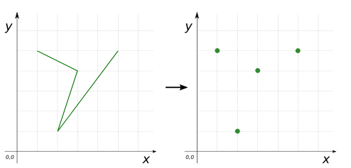
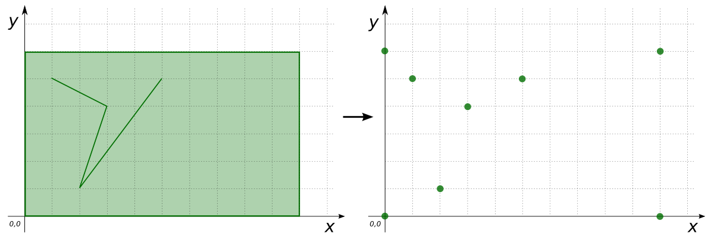

### Signature


MULTIPOINT ST_ToMultiPoint(GEOMETRY geom);


### Description
`ST_ToMultiPoint` constructs a `MULTIPOINT` from the given Geometry's coordinates.

### Examples


SELECT ST_ToMultiPoint('POINT(5 5)');
-- Answer: MULTIPOINT ((5 5))

SELECT ST_ToMultiPoint('MULTIPOINT(5 5, 1 2, 3 4, 99 3)');
-- Answer: MULTIPOINT ((5 5), (1 2), (3 4), (99 3))

SELECT ST_ToMultiPoint('LINESTRING(5 5, 1 2, 3 4, 1 5)');
-- Answer: MULTIPOINT ((5 5), (1 2), (3 4), (1 5))



SELECT ST_ToMultiPoint('POLYGON ((0 0, 10 0, 10 5, 0 5, 0 0))');
-- Answer: MULTIPOINT ((0 0), (10 0), (10 5), (0 5), (0 0))

SELECT ST_ToMultiPoint(
    'MULTIPOLYGON(((28 26,28 0,84 0,84 42,28 26),
    (52 18,66 23,73 9,48 6,52 18)), 
    ((59 18,67 18,67 13,59 13,59 18)))');
-- Answer: MULTIPOINT ((28 26), (28 0), (84 0), (84 42), (28 26), 
--  (52 18), (66 23), (73 9), (48 6), (52 18), (59 18), 
--  (67 18), (67 13), (59 13), (59 18))

SELECT ST_ToMultiPoint('GEOMETRYCOLLECTION(
    POLYGON ((0 0, 10 0, 10 6, 0 6, 0 0)), 
    LINESTRING(5 5, 1 2, 3 4, 1 5))');
-- Answer: MULTIPOINT ((0 0), (10 0), (10 6), (0 6), (0 0), 
--  (5 5), (1 2), (3 4), (99 3))



CREATE TABLE input_table(line LINESTRING);
INSERT INTO input_table VALUES 
    ('LINESTRING(5 5, 1 2, 3 4, 0 3))'::Geometry), 
    ('LINESTRING(0 0, 1 -2, 3 1))'::Geometry), 
    ('LINESTRING(0 1, 2 2, 3 6))'::Geometry);
SELECT ST_ToMultiPoint(ST_Accum(line)) FROM input_table;
-- Answer: MULTIPOINT ((5 5), (1 2), (3 4), (0 3), (0 0), 
--  (1 -2), (3 1), (0 1), (2 2), (3 6))


##### See also

* <a href="https://github.com/irstv/H2GIS/blob/master/h2spatial-ext/src/main/java/org/h2gis/h2spatialext/function/spatial/convert/ST_ToMultiPoint.java" target="_blank">Source code</a>
