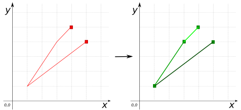

### Signature


MULTILINESTRING ST_ToMultiSegments(GEOMETRY geom);


### Description
`ST_ToMultiSegments` converts a `GEOMETRY` into a set of distinct segments stored in a `MULTILINESTRING`. 
Returns `MULTILINESTRING EMPTY` for Geometries of dimension 0

### Examples


SELECT ST_ToMultiSegments('LINESTRING EMPTY');
-- Answer: MULTILINESTRING EMPTY

SELECT ST_ToMultiSegments('POINT(5 5)');
-- Answer: MULTILINESTRING EMPTY

SELECT ST_ToMultiSegments('LINESTRING(5 4, 1 1, 3 4, 4 5)');
-- Answer: MULTILINESTRING ((5 4, 1 1), (1 1, 3 4), (3 4, 4 5))



SELECT ST_ToMultiSegments(
    'MULTILINESTRING((1 4 3, 15 7 9, 16 17 22), 
    (0 0 0, 1 0 0, 1 2 0, 0 2 1))');
-- Answer: MULTILINESTRING ((1 4, 15 7), (15 7, 16 17),
--  (0 0, 1 0), (1 0, 1 2), (1 2, 0 2))

SELECT ST_ToMultiSegments(
    'POLYGON ((0 0, 10 0, 10 6, 0 6, 0 0),
    (1 1, 2 1, 2 5, 1 5, 1 1))');
-- Answer: MULTILINESTRING ((0 0, 10 0), (10 0, 10 6), 
--  (10 6, 0 6), (0 6, 0 0), (1 1, 2 1), (2 1, 2 5), 
--  (2 5, 1 5), (1 5, 1 1))



SELECT ST_ToMultiSegments('GEOMETRYCOLLECTION(
    POLYGON ((0 0, 10 0, 10 5, 0 5, 0 0), 
    (1 1, 2 1, 2 4, 1 4, 1 1), (7 1, 8 1, 8 3, 7 3, 7 1)), 
    POINT(2 3), 
    LINESTRING (8 7, 9 5, 11 3))');
-- Answer:MULTILINESTRING ((0 0, 10 0), (10 0, 10 5), 
--  (10 5, 0 5),(0 5, 0 0), (1 1, 2 1), (2 1, 2 4), 
--  (2 4, 1 4), (1 4, 1 1), (7 1, 8 1), (8 1, 8 3), 
--  (8 3, 7 3), (7 3, 7 1), (8 7, 9 5), (9 5, 11 3))

SELECT ST_ToMultiSegments(
    'POLYGON ((0 0, 10 0, 10 6, 0 6, 0 0),
    (1 1, 2 1, 2 5, 1 5, 1 1), (7 1, 8 1, 8 3, 7 3, 7 1))');
SELECT ST_ToMultiLine('POLYGON ((0 0, 10 0, 10 6, 0 6, 0 0),
    (1 1, 2 1, 2 5, 1 5, 1 1), (7 1, 8 1, 8 3, 7 3, 7 1))');
-- Answer: 
--  MULTILINESTRING ((0 0, 10 0), (10 0, 10 6), (10 6, 0 6), 
--  (0 6, 0 0), (1 1, 2 1), (2 1, 2 5), (2 5, 1 5), (1 5, 1 1),
--  (7 1, 8 1), (8 1, 8 3), (8 3, 7 3), (7 3, 7 1))
--  MULTILINESTRING ((0 0, 10 0, 10 6, 0 6, 0 0), 
--  (1 1, 2 1, 2 5, 1 5, 1 1), (7 1, 8 1, 8 3, 7 3, 7 1))


##### See also

* [`ST_ToMultiLine`](../ST_ToMultiLine)
* <a href="https://github.com/irstv/H2GIS/blob/master/h2spatial-ext/src/main/java/org/h2gis/h2spatialext/function/spatial/convert/ST_ToMultiSegments.java" target="_blank">Source code</a>
