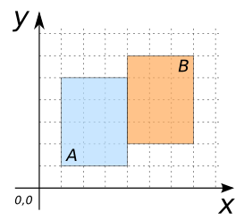
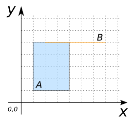
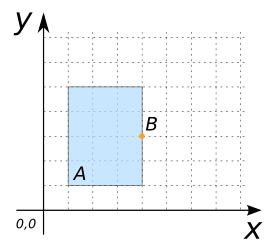
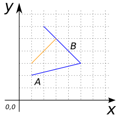
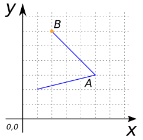

### Signatures


boolean ST_Touches(GEOMETRY geomA, GEOMETRY geomB);


### Description

Returns true if `geomA` touches `geomB`.

Touches means that:
  * `geomA` and `geomB` have at least one point in common.
  * The interiors of `geomA` and `geomB` do not intersect.

##### Remarks
  * `ST_Touches` can only be used to determine the relation between pairs listed here : `(POLYGON, POLYGON)`, `(POLYGON, LINESTRING)`, `(POLYGON, POINT)`, `(LINESTRING, LINESTRING)` and `(LINESTRING, POINT)`. The relation `(POINT, POINT)` is excluded. 
  * `GEOMETRYCOLLECTION`s are not taken into account.



### Examples

##### Cases where `ST_Touches` is true
 

SELECT ST_Touches(geomA, geomB) FROM input_table;
-- Answer:    True


| geomA POLYGON | geomB POLYGON |
| ----|---- |
| POLYGON ((1 1, 4 1, 4 5, 1 5, 1 1)) | POLYGON ((4 2, 7 2, 7 6, 4 6, 4 2)) |

| geomA POLYGON | geomB LINESTRING |
| ----|---- |
| POLYGON ((1 1, 4 1, 4 5, 1 5, 1 1)) | LINESTRING (2 5, 7 5) |

| geomA POLYGON | geomB POINT |
| ----|---- |
| POLYGON ((1 1, 4 1, 4 5, 1 5, 1 1)) | POINT (4 3) |

| geomA LINESTRING | geomB LINESTRING |
| ----|---- |
| LINESTRING (2 1, 5 3, 2 6) | LINESTRING (1 3, 3 5) |

| geomA LINESTRING | geomB POINT |
| ----|---- |
| LINESTRING (2 1, 5 3, 2 6) | POINT (2 6) |

##### See also

* [`ST_Intersects`](../ST_Intersects)
* <a href="https://github.com/irstv/H2GIS/blob/master/h2spatial/src/main/java/org/h2gis/h2spatial/internal/function/spatial/predicates/ST_Touches.java" target="_blank">Source code</a>
