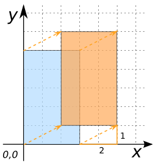

### Signature


GEOMETRY ST_Translate(GEOMETRY geom, double x, double y);


### Description
Translates a `GEOMETRY` to a new location using the numeric parameters as `X` and `Y` offsets.

### Examples


SELECT ST_Translate('POLYGON(( 0 0, 3 0, 3 5, 0 5 , 0 0))', 2, 1);
-- Answer: POLYGON((2 1, 5 1, 5 6, 2 6, 2 1))



SELECT ST_Translate('LINESTRING(-71.01 42.37,-71.11 42.38)', 1, 0.5);
-- Answer: LINESTRING(-70.01 42.87, -70.11 42.88)

SELECT ST_Translate('MULTIPOINT((0 1), (2 2), (1 3))', 1, 0);
-- Answer: MULTIPOINT((1 1), (3 2), (2 3))

SELECT ST_Translate('GEOMETRYCOLLECTION(
                       POLYGON(( 0 0 , 3 5, 6  6 , 0 7, 0 0)), 
                       MULTIPOINT((0 1), (2 2), (1 3))', -1, 1);
-- Answer: GEOMETRYCOLLECTION(
--           POLYGON((-1 1, 2 6, 5 7, -1 8, -1 1)), 
--           MULTIPOINT((-1 2), (1 3), (0 4)))


##### See also

* <a href="https://github.com/irstv/H2GIS/blob/master/h2spatial-ext/src/main/java/org/h2gis/h2spatialext/function/spatial/affine_transformations/ST_Translate.java" target="_blank">Source code</a>
* Added: <a href="https://github.com/irstv/H2GIS/pull/80" target="_blank">#80</a>
