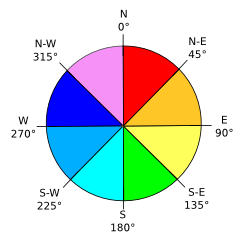

### Signature


DOUBLE ST_TriangleAspect(GEOMETRY geom);


### Description
Returns the aspect value of a triangle. Aspect represents the main slope direction angle compared to the north direction.
The aspect value is expressed in degrees. It can be thought of as the slope direction.

### Examples


SELECT ST_TriangleAspect('POLYGON((0 0 0, 3 0 0, 0 3 0, 0 0 0))');
-- Answer: 0.0

SELECT ST_TriangleAspect('POLYGON((0 0 1, 3 0 0, 0 3 1, 0 0 1))');
-- Answer: 90.0

SELECT ST_TriangleAspect('POLYGON((0 0 1, 3 0 1, 0 3 0, 0 0 1))');
-- Answer: 180.0

SELECT ST_TriangleAspect('POLYGON((0 0 1, 3 0 0, 3 3 1, 0 0 1))');
-- Answer: 45.0


##### See also

* [`ST_TriangleContouring`](../ST_TriangleContouring),
[`ST_TriangleDirection`](../ST_TriangleDirection), [`ST_TriangleSlope`](../ST_TriangleSlope)
* <a href="https://github.com/irstv/H2GIS/blob/master/h2spatial-ext/src/main/java/org/h2gis/h2spatialext/function/spatial/topography/ST_TriangleAspect.java" target="_blank">Source code</a>
