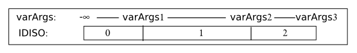
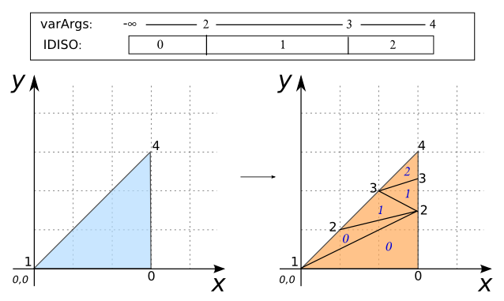
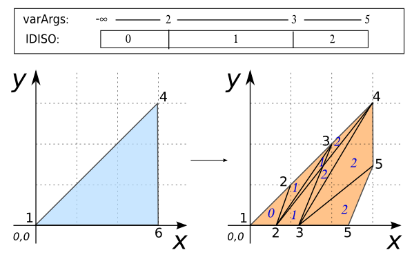

### Signatures


tableName[the_geom, idiso] ST_TriangleContouring(varchar
    tableName, INT varArgs);
tableName[the_geom,, idiso] ST_TriangleContouring(varchar
    tableName, VARCHAR colName, INT varArgs);


### Description
Splits triangle into POLYGONs within the specified range of values (`varArgs`).
Iso contouring using Z or table columns as value of vertex.

### Examples


CREATE TABLE TIN AS SELECT 'POLYGON((0 0 1, 3 0 0, 3 3 4, 0 0 1))
                                           '::geometry the_geom;
SELECT * FROM ST_TriangleContouring('TIN', 2, 3, 4);
-- Answer:
-- |                    THE_GEOM                   | IDISO |
-- | --------------------------------------------- | ----- |
-- | POLYGON((3 1.5 2, 1 1 2, 0 0 1, 3 1.5 2))     |     0 |
-- | POLYGON((3 1.5 2, 0 0 1, 3 0 0, 3 1.5 2))     |     0 |
-- | POLYGON((3 2.25 3, 2 2 3, 3 1.5 2, 3 2.25 3)) |     1 |
-- | POLYGON((2 2 3, 1 1 2, 3 1.5 2, 2 2 3))       |     1 |
-- | POLYGON((3 2.25 3, 3 3 4, 2 2 3, 3 2.25 3))   |     2 |



CREATE TABLE TIN AS SELECT 'POLYGON((0 0 1, 3 0 0, 3 3 4, 0 0 1))
                                           '::geometry the_geom,
                           1.0 as m1, 6 as m2, 4.0 as m3;
SELECT * FROM ST_TriangleContouring('TIN', 'm1', 'm2', 'm3', 2, 3, 5);
-- Answer:
-- |               THE_GEOM               |  m1 |  m2 |  m3 | IDISO |
-- | ------------------------------------ | --- | --- | --- | ----- |
-- | POLYGON((0.6 0 0.8, 1 1 2, 0 0 1,    | 1.0 |   6 | 4.0 |     0 |
-- |          0.6 0 0.8))                 |     |     |     |       |
-- | POLYGON((1.8 1.5 2.4, 2 2 3,         | 1.0 |   6 | 4.0 |     1 |
-- |          0.6 0 0.8, 1.8 1.5 2.4))    |     |     |     |       |
-- | POLYGON((2 2 3, 1 1 2, 0.6 0 0.8,    | 1.0 |   6 | 4.0 |     1 |
-- |          2 2 3))                     |     |     |     |       |
-- | POLYGON((1.2 0 0.6, 1.8 1.5 2.4,     | 1.0 |   6 | 4.0 |     1 |
-- |          0.6 0 0.8, 1.2 0 0.6))      |     |     |     |       |
-- | POLYGON((1.8 1.5 2.4, 3 3 4, 2 2 3,  | 1.0 |   6 | 4.0 |     2 |
-- |          1.8 1.5 2.4))               |     |     |     |       |
-- | POLYGON((1.2 0 0.6, 3 3 4,           | 1.0 |   6 | 4.0 |     2 |
-- |          1.8 1.5 2.4, 1.2 0 0.6))    |     |     |     |       |
-- | POLYGON((2.4 0 0.2, 3 1.5 2,         | 1.0 |   6 | 4.0 |     2 |
-- |          1.2 0 0.6, 2.4 0 0.2))      |     |     |     |       |
-- | POLYGON((3 1.5 2, 3 3 4, 1.2 0 0.6,  | 1.0 |   6 | 4.0 |     2 |
-- |          3 1.5 2))                   |     |     |     |       |

-- Note: Iso Contouring not takes into account the Z or table
-- columns as value of vertex which is above of last varArgs.


##### See also

* [`ST_TriangleAspect`](../ST_TriangleAspect),
[`ST_TriangleDirection`](../ST_TriangleDirection), [`ST_TriangleSlope`](../ST_TriangleSlope)
* <a href="https://github.com/irstv/H2GIS/blob/master/h2spatial-ext/src/main/java/org/h2gis/h2spatialext/function/spatial/topography/ST_TriangleContouring.java" target="_blank">Source code</a>
