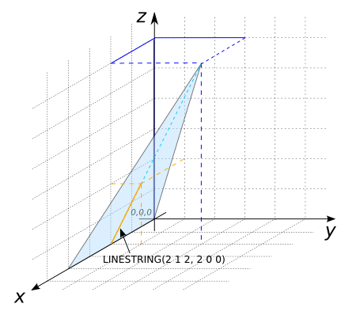

### Signature


LINESTRING ST_TriangleDirection(GEOMETRY geom);


### Description
Computes the main slope direction on a triangle and represent it as a
LINESTRING.

### Examples


SELECT ST_TriangleDirection('POLYGON((0 0 0, 2 0 0, 1 1 0, 0 0 0))');
-- Answer: LINESTRING EMPTY

SELECT ST_TriangleDirection('POLYGON((0 0 0, 4 0 0, 2 3 6, 0 0 0))');
-- Answer: LINESTRING(2 1 2, 2 0 0)


##### See also

* [`ST_TriangleAspect`](../ST_TriangleAspect),
[`ST_TriangleContouring`](../ST_TriangleContouring), [`ST_TriangleSlope`](../ST_TriangleSlope)
* <a href="https://github.com/irstv/H2GIS/blob/master/h2spatial-ext/src/main/java/org/h2gis/h2spatialext/function/spatial/topography/ST_TriangleDirection.java" target="_blank">Source code</a>
