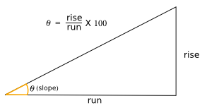
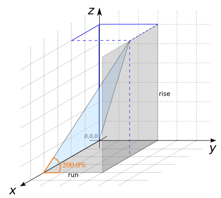

### Signature


DOUBLE ST_TriangleSlope(GEOMETRY geom);


### Description
Computes the slope direction of a triangle expressed in percents.

### Examples


SELECT ST_TriangleSlope('POLYGON((0 0 0, 2 0 0, 1 1 0, 0 0 0))');
-- Answer: 0

SELECT ST_TriangleSlope('POLYGON((0 0 10, 10 0 1, 5 5 10, 0 0 10))');
-- Answer: 127.27922061357853

SELECT ST_TriangleSlope('POLYGON((0 0 0, 4 0 0, 2 3 6, 0 0 0))');
-- Answer: 200.0


##### See also

* [`ST_TriangleAspect`](../ST_TriangleAspect),
[`ST_TriangleContouring`](../ST_TriangleContouring), [`ST_TriangleDirection`](../ST_TriangleDirection)
* <a href="https://github.com/irstv/H2GIS/blob/master/h2spatial-ext/src/main/java/org/h2gis/h2spatialext/function/spatial/topography/ST_TriangleSlope.java" target="_blank">Source code</a>
