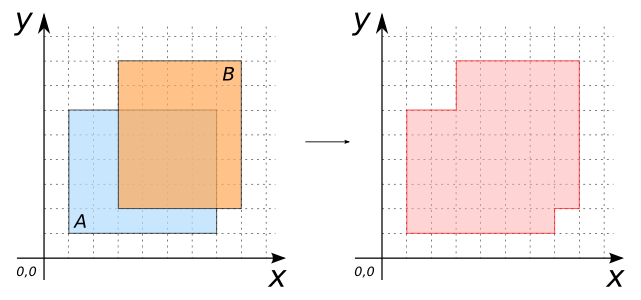

### Signatures


GEOMETRY ST_Union(GEOMETRY geomA, GEOMETRY geomB)
GEOMETRY ST_Union(GEOMETRYCOLLECTION geom)


### Description

ST_Union can be used as a scalar or an aggregate function.

##### Scalar function

Computes the union of two or more Geometries.
Input Geometries can be (MULTI)`POINT`s, (MULTI)`LINESTRING`s, (MULTI)`POLYGON`s or `GEOMETRYCOLLECTION`s.

##### Aggregate function
Computes the union of a set of Geometries.
Input Geometry is a `GEOMETRYCOLLECTION` resulting on a `ST_Accum` operation on a table.

##### In both cases (scalar and aggregate): 
  * if no input Geometries, the result is `NULL`.
  * output Geometries can be single or multiple.



### Examples

##### Scalar function

| geomA Polygon | geomB Polygon |
| ----|---- |
| POLYGON((1 1, 7 1, 7 6, 1 6, 1 1)) | POLYGON((3 2, 8 2, 8 8, 3 8, 3 2)) |


SELECT ST_Union(geomA, geomB);
-- Answer: POLYGON((7 2, 7 1, 1 1, 1 6, 3 6, 3 8, 8 8, 8 2, 7 2))


##### Aggregate function


CREATE TABLE input_table(geom POLYGON);
INSERT INTO input_table VALUES
     ('POLYGON((1 1, 7 1, 7 6, 1 6, 1 1))'::Geometry),
     ('POLYGON((3 2, 8 2, 8 8, 3 8, 3 2))'::Geometry),
     ('POLYGON((1 7, 2 7, 2 8, 1 8, 1 7))'::Geometry);
SELECT ST_Union(ST_Accum(geom)) FROM input_table;
-- Answer: MULTIPOLYGON (((1 7, 2 7, 2 8, 1 8, 1 7)), ((7 2, 7 1, 1 1, 1 6, 3 6, 3 8, 8 8, 8 2, 7 2)))


##### See also

* [`ST_Accum`](../ST_Accum)
* <a href="https://github.com/irstv/H2GIS/blob/master/h2spatial/src/main/java/org/h2gis/h2spatial/internal/function/spatial/operators/ST_Union.java" target="_blank">Source code</a>
