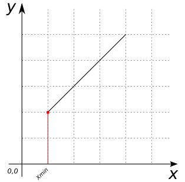

### Signature


POINT ST_XMin(Geometry geom);


### Description

Returns the minimum x-value of the given geometry.

### Example


SELECT ST_XMin('LINESTRING(1 2 3, 4 5 6)'::Geometry);
-- Answer:    1.0


##### See also

* [`ST_XMax`](../ST_XMax), [`ST_YMax`](../ST_YMax), [`ST_YMin`](../ST_YMin), [`ST_ZMax`](../ST_ZMax), [`ST_ZMin`](../ST_ZMin)
* <a href="https://github.com/irstv/H2GIS/blob/master/h2spatial-ext/src/main/java/org/h2gis/h2spatialext/function/spatial/properties/ST_XMin.java" target="_blank">Source code</a>
* Added: [#28](https://github.com/irstv/H2GIS/pull/28)
