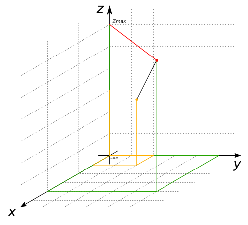

### Signature


double ST_ZMax(GEOMETRY geom);


### Description

Returns the maximum z-value of `geom`.

### Example


SELECT ST_ZMax('LINESTRING(1 2 3, 4 5 6)');
-- Answer:    6.0


##### See also

* [`ST_XMin`](../ST_XMin), [`ST_XMax`](../ST_XMax), [`ST_YMax`](../ST_YMax), [`ST_YMin`](../ST_YMin), [`ST_ZMin`](../ST_ZMin)
* <a href="https://github.com/irstv/H2GIS/blob/master/h2spatial-ext/src/main/java/org/h2gis/h2spatialext/function/spatial/properties/ST_ZMax.java" target="_blank">Source code</a>
* Added: <a href="https://github.com/irstv/H2GIS/pull/28" target="_blank">#28</a>
