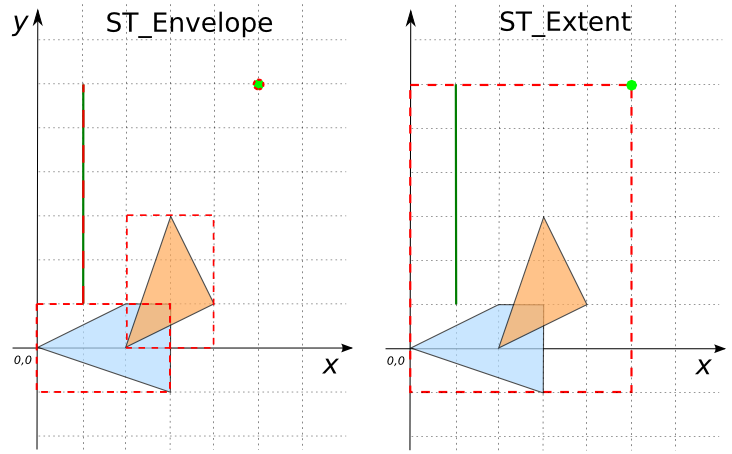

```sql
CREATE TABLE input_table(geom GEOMETRY);
INSERT INTO input_table VALUES
     ('POLYGON((0 0, 3 -1, 1.5 2, 0 0))'),
     ('POLYGON((2 0, 3 3, 4 2, 2 0))'),
     ('POINT(5 6)'),
     ('LINESTRING(1 1, 1 6)');
```

`ST_Envelope` is a scalar function.
```sql
SELECT ST_Envelope(geom) ENV FROM input_table;
```
Answer:
|                  ENV                   |
|----------------------------------------|
| POLYGON((0 -1, 0 6, 5 6, 5 -1, 0 -1))  |
| POLYGON((2 0, 2 3, 4 3, 4 0, 2 0))     |
| POINT(5 6)                             |
| LINESTRING(1 1, 1 6)                   |


`ST_Extent` is an aggregate function.
```sql
SELECT ST_Extent(geom) EXT FROM input_table;
```

Answer: POLYGON((0 -1, 0 2, 3 2, 3 -1, 0 -1))

However, we can make `ST_Envelope` behave like `ST_Extent` as follows:
```sql
SELECT ST_Equals(ST_Envelope(ST_Accum(geom)),
                 ST_Extent(geom)) FROM input_table;
```
Answer: `TRUE`

{align=center}