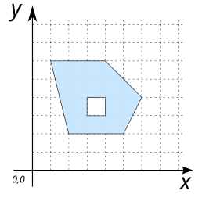
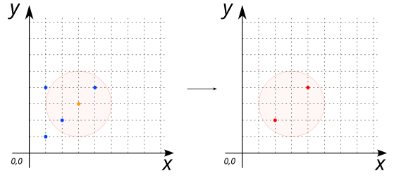

# GEOMETRY data type

H2GIS can handle `GEOMETRY` geospatial datasets.

## Supported geometry types

[H2 database](https://www.h2database.com/html/datatypes.html#geometry_type) and H2GIS supports the following geometry types:

* `GEOMETRY` : any kind of geometries, without any constraints,
* `POINT` : a geometry that represents a location in space (dimension = 0),
* `LINESTRING` : a linear geometry made of points connected thanks by segments (dimension = 1),
* `POLYGON` : a surfacic geometry made of points connected by segments and where the last point is equal to the first one (the polygon has to be closed). By definition a `POLYGON` has an exterior boundary and between O and *n* interior boundaries (holes) (dimension = 2),
* `MULTIPOINT` : a complex geometry, made of a set of `POINT`'s,
* `MULTILINESTRING` : a complex geometry, made of a set of `LINESTRING`'s,
* `MULTIPOLYGON` : a complex geometry, made of a set of `POLYGON`'s,
* `GEOMETRYCOLLECTION` : a set of simple and/or complex geometries (`POINT`, `LINESTRING`, `POLYGON`, `MULTIPOINT`, `MULTILINESTRING` and `MULTIPOLYGON`).

## Supported coordinates

For each of the geometry types, [H2 database](https://www.h2database.com/html/datatypes.html#geometry_type) and H2GIS supports the following geometry coordinates:
* 2D : `X Y`
* Z : `X Y Z`
* M : `X Y M`
* ZM : `X Y Z M`

## Projection management

[H2 database](https://www.h2database.com/html/datatypes.html#geometry_type) and H2GIS allows to manage SRS ([Spatial reference system](https://en.wikipedia.org/wiki/Spatial_reference_system)) thanks to the specification of SRID (Spatial Reference System Identifier) constraint on geometries.

To do so, user just have to add the SRID after the geometry type when creating a table.
Example : `GEOMETRY(POINT Z, 4326)`

See some dedicated H2GIS functions [here](./projections).

## Table creation examples

Here are some examples to create a table named `myTable` in which we have two columns : the geometry `the_geom` and a unique identifier (Primary Key) `id`:

```sql
CREATE TABLE myTable(the_geom GEOMETRY, id INTEGER PRIMARY KEY);
```
The same but with adding some constraints on geometry and `SRID`:

* With various geometry types
```sql
CREATE TABLE myTable(the_geom GEOMETRY(POINT), id INTEGER PRIMARY KEY);
CREATE TABLE myTable(the_geom GEOMETRY(LINESTRING), id INTEGER PRIMARY KEY);
CREATE TABLE myTable(the_geom GEOMETRY(MULTIPOLYGON), id INTEGER PRIMARY KEY);
CREATE TABLE myTable(the_geom GEOMETRY(GEOMETRYCOLLECTION), id INTEGER PRIMARY KEY);
```

* With the various coordinates
```sql
CREATE TABLE myTable(the_geom GEOMETRY(POINT), id INTEGER PRIMARY KEY);
CREATE TABLE myTable(the_geom GEOMETRY(POINT Z), id INTEGER PRIMARY KEY);
CREATE TABLE myTable(the_geom GEOMETRY(POINT M), id INTEGER PRIMARY KEY);
CREATE TABLE myTable(the_geom GEOMETRY(POINT ZM), id INTEGER PRIMARY KEY);
```

* With SRID
```sql
CREATE TABLE myTable(the_geom GEOMETRY(POINT, 4326), id INTEGER PRIMARY KEY);
CREATE TABLE myTable(the_geom GEOMETRY(MULTIPOLYGON ZM, 2154), id INTEGER PRIMARY KEY);
```

## Specifying geometries on the fly

[H2 database](https://www.h2database.com/html/datatypes.html#geometry_type) and H2GIS allows you to manipulate geometries on the fly in a query, using a quoted string (' '), containing a [WKT](https://en.wikipedia.org/wiki/Well-known_text_representation_of_geometry)/EWKT formatted chain.

### Examples

Generate a `POINT` in a `SELECT`:

```sql
SELECT 'POINT(348238.151 6683011.940)'::GEOMETRY;
```
Note that: we are using `::` symbol to cast the string chain `POINT(348238.151 6683011.940)` into a geometry, so that it can be interpreted by H2/H2GIS.

Since the coordinates are here in Lambert 93 - [EPSG:2154](https://spatialreference.org/ref/epsg/2154/), we can force the SRID in the same time:

```sql
SELECT 'SRID=2154; POINT(348238.151 6683011.940)'::GEOMETRY;
```

---

Generate a `POLYGON` (having a hole) in a `SELECT`. 

```sql
SELECT 'POLYGON((2 2, 5 2, 6 4, 4 6, 1 6, 2 2), (3 3, 3 4, 4 4, 4 3, 3 3))'::GEOMETRY;
```

{align=center}

---

In this example, we want to select the houses that are at a certain distance from a point, which is defined on the fly in the query (not stored before in a table).

1. Creation of the table `HOUSES` in which we store 4 houses:
```sql
DROP TABLE IF EXISTS HOUSES;
CREATE TABLE HOUSES (id INTEGER PRIMARY KEY, the_geom GEOMETRY(POINT));
INSERT INTO HOUSES (id, the_geom) VALUES 
   (1, 'POINT(1 1)'), (2, 'POINT(2 2)'), (3, 'POINT(1 4)'), (4, 'POINT(4 4)');
```

2. We can now select the houses that are less than 2 meters from a `POINT(3 3)`:
```sql
SELECT a.* FROM HOUSES h, (SELECT 'POINT(3 3)'::GEOMETRY the_geom) p 
   WHERE ST_Distance(h.the_geom, p.the_geom)<2;
```
Answer:

| ID | THE_GEOM    |
|----|-------------|
| 2  | POINT(2 2)  |
| 4  | POINT(4 4)  |

{align=center}

## See also

* [How to manage spatial indices?](../spatial-indices)