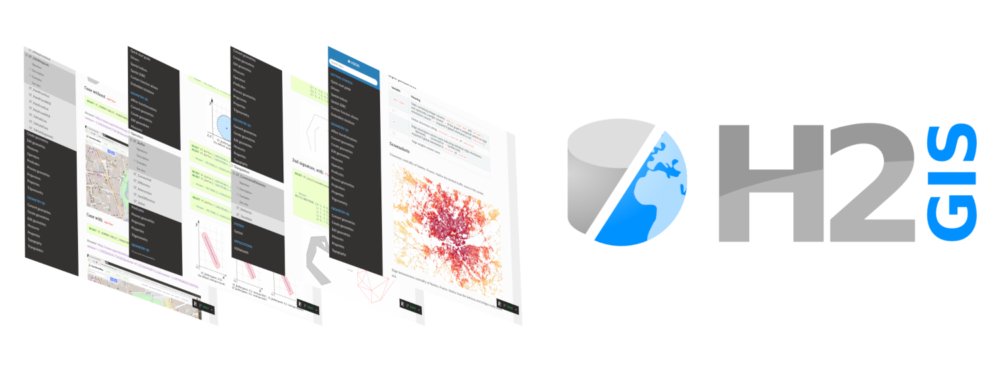
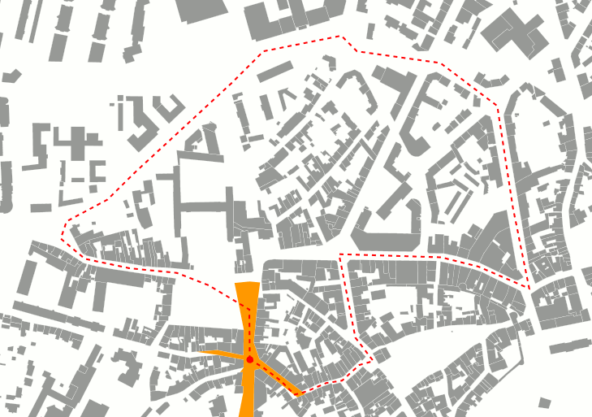
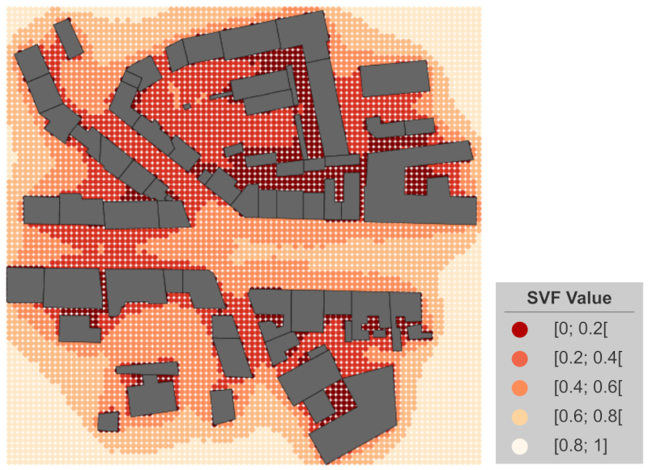

.. H2GIS Documentation documentation master file, created by
   sphinx-quickstart on Fri Apr  4 10:52:34 2025.
   You can adapt this file completely to your liking, but it should at least
   contain the root `toctree` directive.

H2GIS Documentation
=================================

Welcome on the H2GIS's documentation, a spatial extension for the `H2 database <http://www.h2database.com/>`_ engine.

What is H2GIS?
-----------------

In a nutshell: H2GIS is to `H2 <http://www.h2database.com/>`_ as `PostGIS <http://postgis.net/>`_ is to `PostgreSQL <http://www.postgresql.org/>`_.

H2GIS adds support for:

* ``(MULTI)POINT``, ``(MULTI)LINESTRING`` and ``(MULTI)POLYGON`` types
* the functions specified by the `OpenGIS <http://www.opengeospatial.org/>`_ `Simple Features Implementation Specification for SQL <http://www.opengeospatial.org/standards/sfs>`_
* additional spatial functions we develop, including our graph analysis package `H2Network <./h2network.html>`_

H2GIS in action
----------------

The following is just a small sample of what H2GIS has to offer

.. |buffer| image:: ./ST_Buffer_5.png
   :align: middle

   

.. list-table::
   :widths: 15 75
   :align: center
   :header-rows: 0

   * - `Buffer <./ST_Buffer.html>`_
     - |buffer|
   * - `Sky View Factor <./ST_SVF.html>`_
     - |svf|
   * - `ISOvist <./ST_ISOVist.html>`_
     - |isovist|

 
Why using H2GIS?
-----------------

* Free and open-source (`LGPL v3.0 <https://github.com/orbisgis/h2gis/?tab=LGPL-3.0-1-ov-file>`_)
* Made by french public researchers from `CNRS <https://www.cnrs.fr>`_
* Very lightweight (less than 15mb once unzipped)
* Standalone: no installation / configuration needed
* Easy to embed in (mobile) apps
* Cross-platform
* `Simple Feature SQL <https://www.ogc.org/standards/sfs/>`_ compliant

Download the last version
--------------------------
You can download the last release of H2GIS `here <https://github.com/orbisgis/h2gis/releases>`_ 

Get help
-----------------

If you get stuck or just have a question, please `fill an issue <http://github.com/orbisgis/h2gis/issues/new>`_ on our GitHub repo.

--------------------------------------------------------------------------

Documentation
----------------
.. toctree::
    :maxdepth: 1
    :caption: Getting started
    
    quickstart
    drivers
    spatial-indices
    CHANGELOG

.. toctree::
    :maxdepth: 1
    :caption: Geometry 2D functions
    
    affine-transformations
    geometry-conversion
    geometry-creation
    edit-geometries
    distance-functions
    operators
    predicates
    process-geometries
    projections
    properties
    trigonometry
    
.. toctree::
    :maxdepth: 1
    :caption: Geometry 3D functions
    
    geometry-conversion-3D
    geometry-creation-3D
    edit-geometries-3D
    distance-functions-3D
    properties-3D
    topography-3D
    triangulation-3D

.. toctree::
    :maxdepth: 1
    :caption: System functions
    
    system

.. toctree::
    :maxdepth: 1
    :caption: Applications
    
    h2network
    
.. toctree::
    :maxdepth: 1
    :caption: For developers
    
    spatial-jdbc
    function-aliases
    embedded-spatial-db
