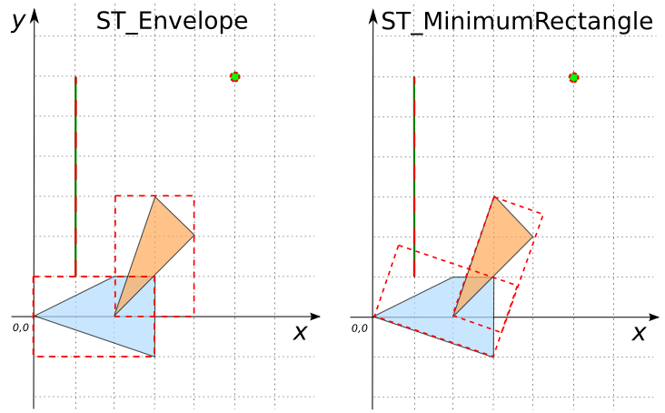

```sql
CREATE TABLE input_table(geom GEOMETRY);
INSERT INTO input_table VALUES
     ('POLYGON((0 0, 3 -1, 3 1, 2 1, 0 0))'),
     ('POLYGON((2 0, 3 3, 4 2, 2 0))'),
     ('POINT(5 6)'),
     ('LINESTRING(1 1, 1 6)');

SELECT ST_Envelope(geom) ENV, ST_MinimumRectangle(geom) MinRect
      FROM input_table;
```
Answer:
|            ENV           |          MinRect            |
|--------------------------|-----------------------------|
| POLYGON((0 -1, 0 1, 3 1, 3 -1, 0 -1)) | POLYGON((3 -1, 3.59 0.80, 0.6 1.79, 0 -0, 3 -1))   |
| POLYGON((2 0, 2 3, 4 3, 4 0, 2 0))    | POLYGON((2 -0, 3.2 -0.40, 4.20 2.59, 3 2.99, 2 0)) |
| POINT(5 6)                            | POINT(5 6)                                         |
| LINESTRING(1 1, 1 6)                  | LINESTRING(1 1, 1 6)                               |

{align=center}