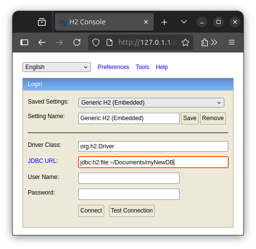
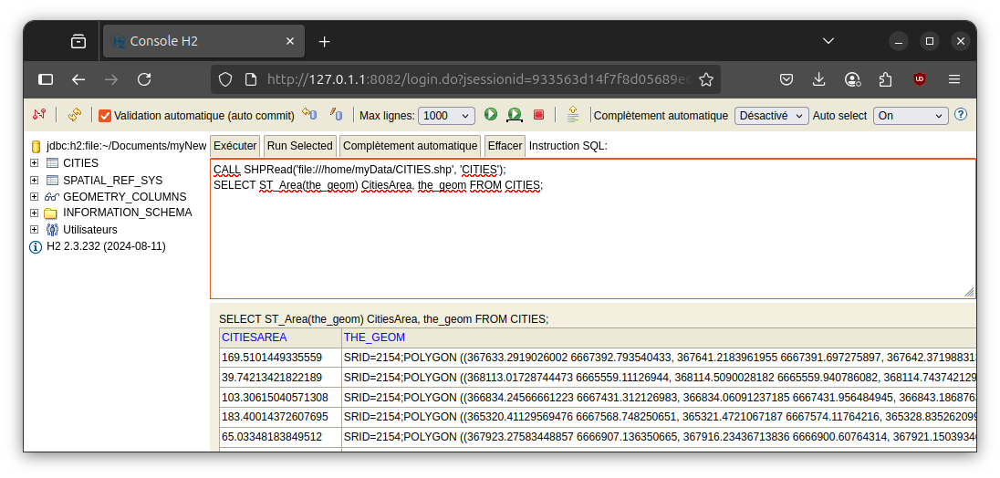
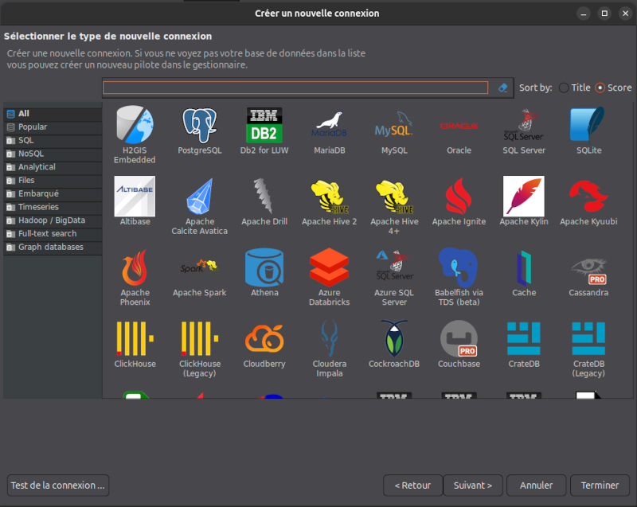

# Quick-start guide

## Requirements

H2/H2GIS is cross-platform. This means it works equally well on Linux, Windows or Mac.

The only prerequisite is that **you will need a working [Java](http://java.com/en/download/index.jsp) runtime environment**.

Administrator rights are not required.

## Download and launch H2GIS

Just follow these steps:

1. Go to the official H2GIS GitHub home page ([here](https://github.com/orbisgis/h2gis/releases)) and download the latest H2GIS release &rarr; `h2gis-standalone-bin.zip`,
2. Unzip this file,
3. In the folder `/h2gis-standalone-bin/`, run the `.jar` file called `h2-dist-x.x.x` (where `x.x.x` is the release number) &rarr; the following tab should open in your default web browser,

{align=center}

4. If it's not already the case, select `Generic H2 (Embedded)` in the `Saved Settings` list. Then, in the `URL JDBC` text area, just give a name to the new database file you will create (in the example `myNewDB`). Optionally, you can also configure the connection with a user name and password. Once ready click on **Connect**. 
5. You are now in the H2/H2GIS console. You can execute SQL instructions using the console.

{align=center}

:::{warning}
To execute spatial SQL instructions you have **first** to **initialize the H2GIS extension**. Have a look to [this section](#initialize-the-h2gis-extension) to know how.
:::

### Command-line

Command-line gurus can also download and launch H2GIS thanks to command-lines.

#### On Linux

In a terminal (`Ctrl+Alt+T`), just execute the following commands *(example with v2.2.3)*:

```console
~ $ wget https://github.com/orbisgis/h2gis/releases/download/v2.2.3/h2gis-standalone-bin.zip
~ $ unzip h2gis-standalone-bin.zip
~ $ cd h2gis-standalone
~/h2gis-standalone $ java -jar h2gis-dist-2.2.3.jar
```
The execution of the .jar file, will load the web interface seen above.

#### On Mac

In a terminal, just execute the following commands *(example with v2.2.3)*:

```console
~ $ curl -L https://github.com/orbisgis/h2gis/releases/download/v2.2.3/h2gis-standalone-bin.zip -o h2gis-standalone-bin.zip
~ $ unzip h2gis-standalone-bin.zip
~ $ cd h2gis-standalone
~/h2gis-standalone $ java -jar h2gis-dist-2.2.3.jar
```

## Initialize the H2GIS extension

Once connected to a new H2GIS database, users have to load the spatial functions. To do so, in the SQL console, just execute the following SQL instructions:

```sql
CREATE ALIAS IF NOT EXISTS H2GIS_SPATIAL FOR "org.h2gis.functions.factory.H2GISFunctions.load";
CALL H2GIS_SPATIAL();
```

:::{tip}
Of course, you only need to do this the first time. When you reopen an existing database, you don't need to re-execute these instructions.
:::

Once done, you will see in the left-side part new spatial elements:
* `SPATIAL_REF_SYS` : table where all the CRS are stored
* `GEOMETRY_COLUMNS` : metadata view storing all the system's tables needed to manipulate geometry 

{align=center}

You are now ready to play with H2GIS. For example you can load a shape file and calculate the area of each geometries:

```sql
CALL SHPRead('file:///home/myData/CITIES.shp', 'CITIES');
SELECT ST_Area(the_geom) CitiesArea, the_geom FROM CITIES;
```

{align=center}

## H2GIS via third-party applications

You can also use H2GIS via third-party applications that already integrate it.

### DBeaver

[DBeaver](https://dbeaver.io/) is a super intuitive, nice, free and open-source app to manage relationnal database. It already integrates H2 and H2GIS. So once the app open:

1. Create a new database connection (`Maj+Ctrl+N`)

{align=center}

2. In the search engine, enter `H2` and then click on `H2GIS Embedded`. Press `Next`

{align=center}

3. In the new panel, click on "`Create`" button. Here you have to point the folder in which the database will be stored. 

{align=center}

Once done, press `Save`. You should have something like this

{align=center}

In this example you can see that a new db, named `myDB`, will be stored in the folder `/home/gpetit/H2GISDB`.

5. Press `Terminate`. You can now play with H2GIS in DBeaver

{align=center}

:::{tip}
Here, you don't need to initialize the H2GIS extension. It's already done by DBeaver, in the background.
:::