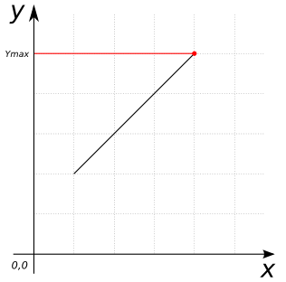

---

layout: docs

title: ST_YMax

prev_section: h2spatial-ext/ST_XMin

next_section: h2spatial-ext/ST_YMin

permalink: /docs/dev/h2spatial-ext/ST_YMax/

---

### Signature


POINT ST_YMax(Geometry geom);


### Description

Returns the maximum y-value of the given geometry.

### Example


SELECT ST_YMax('LINESTRING(1 2 3, 4 5 6)'::Geometry);
-- Answer:    5.0


##### See also

* [`ST_XMin`](../ST_XMin), [`ST_XMax`](../ST_XMax), [`ST_YMin`](../ST_YMin), [`ST_ZMax`](../ST_ZMax), [`ST_ZMin`](../ST_ZMin)
* [Source code](https://github.com/irstv/H2GIS/blob/master/h2spatial-ext/src/main/java/org/h2gis/h2spatialext/function/spatial/properties/ST_YMax.java)
* Added: [#28](https://github.com/irstv/H2GIS/pull/28)
